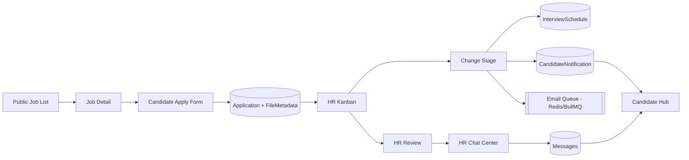

# Thiết kế giao diện và luồng nghiệp vụ

Tài liệu mô tả kiến trúc giao diện (UI) và các luồng nghiệp vụ chính theo role trong dự án `Vuman-Recruitment-Nexus`.

## 1) Mục tiêu thiết kế UI

- Tách rõ 3 ngữ cảnh sử dụng: `Candidate`, `HR`, `Admin`.
- Giảm số bước thao tác cho các task tần suất cao (apply, đổi stage, lên lịch phỏng vấn, chat).
- Phản hồi nhanh bằng realtime (Socket) thay cho refresh thủ công.
- Bảo toàn tính nhất quán giữa web public (career site) và khu vực đăng nhập (dashboard).

## 2) Cấu trúc điều hướng (Information Architecture)

## Công khai (Public)

| Route | Màn hình | Đối tượng | Mục tiêu |
|---|---|---|---|
| `/`, `/jobs` | Job list | Tất cả | Khám phá việc làm, lọc/tìm kiếm |
| `/jobs/:jobId` | Job detail | Tất cả | Xem JD chi tiết |
| `/about` | About / Life at Vuman | Tất cả | Branding, văn hóa, hoạt động |

## Xác thực

| Route | Màn hình | Đối tượng | Mục tiêu |
|---|---|---|---|
| `/login` | Đăng nhập | Tất cả role | Vào hệ thống |
| `/register` | Đăng ký | Candidate | Tạo tài khoản ứng viên |
| `/forgot-password`, `/reset-password` | Quên/đặt lại mật khẩu | Tất cả role | Khôi phục truy cập |
| `/change-password` | Đổi mật khẩu | Đăng nhập | Bảo mật tài khoản |
| `/sessions` | Quản lý phiên | Đăng nhập | Thu hồi phiên thiết bị |

## Candidate

| Route | Màn hình | Mục tiêu chính |
|---|---|---|
| `/apply/:jobId` | Form ứng tuyển đa bước | Nộp hồ sơ + upload CV |
| `/candidate` | Candidate hub | Theo dõi đơn, timeline, task, inbox |
| `/candidate/applications/:appId/review` | Candidate application review | Xem lại đơn, lịch phỏng vấn, note HR (read-only) |
| `/profile` | Profile | Đồng bộ thông tin cho lần apply sau |

## HR/Admin vận hành tuyển dụng

| Route | Màn hình | Quyền |
|---|---|---|
| `/hr/kanban` | Kanban pipeline | HR, Admin |
| `/hr/jobs` | Quản lý job | HR, Admin |
| `/hr/interview-schedules` | Lịch phỏng vấn | HR, Admin |
| `/hr/candidates` | Dashboard ứng viên/pipeline | HR, Admin |
| `/hr/applications/:appId/review` | Review hồ sơ + HR note | HR, Admin |
| `/hr/chats`, `/hr/chats/:appId` | Trung tâm chat HR | HR, Admin |

## Admin quản trị

| Route | Màn hình | Quyền |
|---|---|---|
| `/admin/accounts` | Quản trị tài khoản | Admin |
| `/admin/analytics` | Analytics | Admin |

---

## 3) Thiết kế giao diện theo module

## 3.1 Layout & thành phần dùng chung

- `App shell`: navbar + vùng nội dung + protected route.
- `Navbar`: logo thương hiệu, menu điều hướng, profile menu, theme toggle.
- `Feedback states`: loading skeleton, empty state, toast/error message.
- `Theme`: light/dark theo token CSS.
- `i18n`: hỗ trợ đa ngôn ngữ ở layer UI.

## 3.2 Thiết kế kiến trúc tổng thể (Sửa)

Kiến trúc ba lớp logic: presentation (React + Vite), application/API (Express + Socket.io), persistence (MongoDB). Redis và BullMQ bổ sung tầng xử lý bất đồng bộ (email). Socket.io song song với REST cho sự kiện realtime.

## 3.3 Public/Candidate UX

- **Job List**: card/list + bộ lọc theo phòng ban, location, work mode, keyword.
- **Job Detail**: thông tin JD đầy đủ, CTA apply rõ ràng.
- **Apply đa bước**:
  - Bước thông tin cá nhân.
  - Bước học vấn/kỹ năng/kinh nghiệm.
  - Bước upload CV + message cho HR.
  - Bước xác nhận và submit.
- **Candidate Hub**:
  - Danh sách application theo trạng thái.
  - Timeline stage.
  - Task và nộp tài liệu.
  - Thông báo inbox theo event hồ sơ.

## 3.4 HR/Admin UX

- **Kanban tuyển dụng**:
  - Cột theo stage (`Mới` -> `Đang xét duyệt` -> `Phỏng vấn` -> `Đề xuất` -> `Đã tuyển` / `Không phù hợp`).
  - DnD kéo thả candidate card.
  - Bulk reject nhiều hồ sơ.
- **Application review**:
  - Hồ sơ formData + CV signed URL + lịch phỏng vấn + HR note.
  - Thao tác đổi stage, tạo lịch phỏng vấn.
- **HR Chat Center**:
  - Thread list + chat panel theo `applicationId`.
  - Typing/read state + realtime.
- **Admin**:
  - Quản lý account (CRUD user HR/candidate).
  - Analytics chart/tổng hợp dữ liệu ứng tuyển.

---

## 4) Luồng nghiệp vụ chính (Business Flows)

## 4.1 Luồng ứng tuyển (Candidate Apply Flow)

1. Candidate vào `Job List` -> chọn `Job Detail`.
2. Nhấn `Apply` -> mở form đa bước.
3. Điền dữ liệu + upload CV -> submit.
4. Server lưu `applications` + `filemetadatas`.
5. Queue email xác nhận apply (BullMQ/Redis).
6. Candidate thấy đơn mới trong `Candidate Hub`.
7. HR thấy hồ sơ xuất hiện realtime trên kênh job/pipeline.

## 4.2 Luồng xử lý hồ sơ (HR Pipeline Flow)

1. HR mở `Kanban`.
2. Kéo thả card ứng viên sang stage mới hoặc bulk reject.
3. Server cập nhật `applications.stage`.
4. Nếu stage là phỏng vấn: tạo `interviewschedules`.
5. Hệ thống gửi notification cho candidate (`candidatenotifications`) + emit Socket.
6. Queue email theo event stage (invite/rejected/hired).

## 4.3 Luồng chat theo hồ sơ

1. Candidate/HR join room theo `applicationId`.
2. Gửi tin nhắn -> lưu `messages`.
3. Emit realtime cho room chat.
4. Nếu HR gửi: tạo notification cho candidate + queue email nhắc chat.

## 4.4 Luồng quản trị tài khoản (Admin)

1. Admin vào `Admin Accounts`.
2. Tạo/sửa/khoá user HR/candidate.
3. Với HR mới: bật cờ `mustChangePassword`.
4. User đăng nhập lần đầu -> bắt đổi mật khẩu.

## 4.5 Luồng phiên đăng nhập & bảo mật

1. Login thành công -> phát access + refresh token.
2. Lưu phiên vào `refreshsessions`.
3. Token hết hạn -> refresh tự động.
4. Người dùng có thể revoke từng phiên hoặc logout all.

---

## 5) Trạng thái và sự kiện realtime

| Nguồn sự kiện | Kênh/Đối tượng | Ảnh hưởng UI |
|---|---|---|
| Job mở/đóng | Public/Candidate job list | Cập nhật danh sách job không cần F5 |
| Stage đổi | Candidate hub + HR kanban | Cập nhật timeline/cột pipeline |
| Lịch phỏng vấn tạo/sửa | Candidate review + HR schedule | Đồng bộ lịch và thông báo |
| Chat message | Candidate/HR chat room | Tin nhắn realtime |
| Notification event | Candidate inbox bell | Tăng badge, thêm item mới |

---

## 6) Quy tắc RBAC trên giao diện

- `ProtectedRoute` kiểm tra role trước khi render page.
- Candidate không truy cập module HR/Admin.
- HR không truy cập module Admin-only (`/admin/*`).
- Admin truy cập được phần HR vận hành theo `ALLOW_ROLES_HR_ADMIN`.
- Route legacy `/hr/chat/:appId` redirect về `/hr/chats/:appId`.

---

## 7) Sơ đồ luồng tổng quát (Mermaid)

---

## 8) KPI UX đề xuất để đánh giá

- Tỉ lệ hoàn thành form apply (drop-off theo từng bước).
- Thời gian trung bình từ apply đến stage đầu tiên.
- Thời gian phản hồi chat HR-candidate.
- Tỉ lệ đọc thông báo inbox của candidate.
- Tỉ lệ hồ sơ xử lý qua bulk actions (hiệu suất HR).
